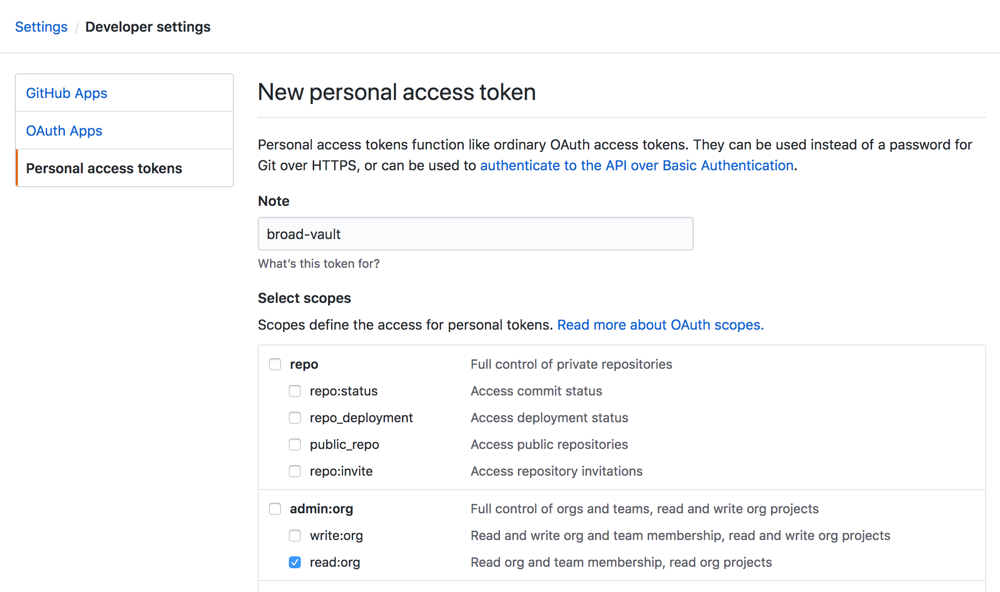

# Getting Started on Monster
Welcome to the Monster team!

## NEW BROADIES START HERE

**DO THESE STEPS BEFORE GOING HOME AFTER ORIENTATION**

### Link GitHub
Permissions in DSP are driven by a combination of GitHub teams and Google groups.
The two are synchronized (to some extent) by nightly jobs run by BITS. Step one for
any new hire should be to link identities in those two systems.

1. Decide if you want to use an existing GitHub account for work, or
   [create a new one](https://github.com/join?source=header-home). We don't have a
   strong preference either way, **but** if you decide to use an existing account
   make sure to add your Broad email to it.
2. [Set up 2-Factor Authentication](https://help.github.com/en/articles/configuring-two-factor-authentication)
   on the account you choose to use. This is required by BITS' account-linking job.
3. Go to [BITS' people app](https://people.broadinstitute.org) and sign in with your
   Broad Google account.
4. On the "My Profile" page, link your profile to GitHub under the "Other Profiles" header.
   You will need to approve the OpenID scopes for the link to go through.
5. Linking accounts should bring you to [this page](https://broad-github.appspot.com/).
   Follow the listed steps to:
   1. Set up 2FA on your Google account (if you haven't already)
   2. Link or relink your GitHub account to your Google account (if needed)
   Once the accounts are properly linked, you should receive an email invite to join
   the `broadinstitute` GitHub organization. Accept the invitation.

### Request Group Access
Request access to these Google Groups via email. These Groups are used to manage recurring
meeting invites and GitHub team membership, so the sooner you can be added, the better.
* [`monster`](mailto:monster+subscribe@broadinstitute.org)
* [`dsde-engineering`](mailto:dsde-engineering+subscribe@broadinstitute.org)
* [`softeng`](mailto:softeng+subscribe@broadinstitute.org)

### Set up Slack
We prefer Slack over email for most communication.

1. Visit Broad's [Slack portal](https://broadinstitute.slack.com/), and log in with
   your Broad Google account.
2. Download the [Slack desktop app](https://slack.com/downloads) and log in.
3. Join the `#monster` channel to get started.

## Join Groups / Teams / Channels
Once you've been synced into BITS' nightly job, you should be able to link into
other relevant organizations / groups / teams.

### Slack Channels

#### Main Channels
Join these channels for sure:
* `#105b` (building / facilities)
* `#dsde-emeraldempire` (Data Engineering)
* `#dsp-engineering`
* `#monster-internal` (Private to Monster, ask a teammate to add you)
* `#prometheus` (DSP-wide)

#### Tech Topics
You might find these channels useful for tech discussions:
* `#beam-dataflow`
* `#kubernetes`
* `#scala`
* `#softeng`
* `#terraform-ansible`

#### Other Emerald Teams
Join some or all of these to keep tabs on other groups in Data Eng:
* `#dsde-ops` (Private; Genomics Platform operations)
* `#dsp-jade` (Data repository)
* `#green-hornet` (Genomics Platform & HCA infrastructure)
* `#green-lantern` (Genomics Platform & HCA scientific pipelines)
* `#wintergreen` (Private; Epigenomics Program pipelines and infrastructure)

`#dsp-jade` is the most relevant for now.

### GitHub Teams
Our GitHub repositories are spread across a few organizations.

#### broadinstitute
This is the default org that you joined on your first day. Ask the Tech Lead to add you to
these teams:
* [DSP Monsters](https://github.com/orgs/broadinstitute/teams/dsp-monsters)

#### DataBiosphere
This org hosts repositories that we feel aren't necessarily tied to Broad infrastructure
or use-cases. Multiple other institutes / companies are included in the org, so only a few
Broad members have the power to add other users.

Have the Tech Lead email the current Broad admins to get you added to the org, then made a
member of these teams:
* [Emerald Writers](https://github.com/orgs/DataBiosphere/teams/broademeraldwrite)

### DockerHub
We host containers for our open-source services in DockerHub. Go [here](https://hub.docker.com/)
to set up an account. Once it's set up, ask the Tech Lead to get you added to the `broadinstitute`
organization and DSDE team within.

### Quay.io
Our workloads can cause scalability issues in DockerHub by concurrently pulling a large
number of images. To avoid hitting this problem, we sometimes choose to host at-risk images
(usually containing command-line programs for scientific workflows) in [Quay](https://quay.io).
Set up an account, and ask the Tech Lead to get you added to the `broadinstitute` organization
and the Monster team within.

### Terra
[Terra](https://terra.bio/) is DSP's flagship product for biomedical research in the cloud.
Monster interacts with Terra's backend to set up ingested datasets. Set up dev and prod accounts
so you can interact with the systems directly when needed.

#### Production
1. Visit the [production Terra app](https://app.terra.bio/)
2. Open the hamburger menu in the top-left, and click the Google sign-in option. Log in with
   your Broad identity.
3. Accept the Terms of Service.
4. Ask the Tech Lead to add you to these Terra groups as a member:
   * [Data Repository Stewards](https://app.terra.bio/#groups/Stewards)

#### Dev
1. Create a throwaway gmail account. We don't use our main Google identities in dev
   in case credentials are accidentally exposed. For the sake of other dev users, we suggest
   using a name like `monster.<your-name>.dev@gmail.com`.
2. Visit the [dev Terra app](https://bvdp-saturn-dev.appspot.com/)
3. Open the hamburger menu in the top-left, and click the Google sign-in option. Log in with
   your new identity.
4. Accept the Terms of Service.
5. Ask a teammate to add you to these Terra groups as an admin:
   * [Data Repository Stewards](https://bvdp-saturn-dev.appspot.com/#groups/JadeStewards-dev)
   * [Data Repository Custodians](https://bvdp-saturn-dev.appspot.com/#groups/JadeCustodians-dev)

### AWS
We maintain a space in AWS for testing our file-transfer systems. The need is uncommon
enough across DSP that DevOps hasn't set up an automated process for acquiring an account,
so work with the Tech Lead to get into the system.

Once you have an account, follow these steps to set up local credentials:
1. Find yourself in the [list of users](https://console.aws.amazon.com/iam/home?region=us-east-1#/users),
   and click the link for your username.
2. Select the "Security Credentials" page.
3. Click "Create access key" to generate a new key ID / secret pair. Copy the secret
   key (or download the CSV).
4. Add your credentials to your local bash environment. To avoid accidentally sharing the secrets,
   we recommend you store them in their own file and then `source` them into your profile:
   ```bash
   # Write config to disk.
   mkdir -p ~/.config/aws
   /bin/cat <-EOF > ~/.config/aws/env
   export AWS_ACCESS_KEY_ID=<your-key-id>
   export AWS_SECRET_ACCESS_KEY=<your-secret>
   EOF

   # Load configs into your profile.
   echo "source '${HOME}/.config/aws'" >> ~/.bash_profile
   ```

## Install Software
If you're running OS X, run [this script](./install-tools) to install all the software we use for
development. It isn't fully automated (a few steps require confirmation / entering a login), but
it should grab everything you need for development work.

If you aren't running OS X, I'm sorry.

Other things to note:
* After running the installation script, you'll need to manually start the
  cask applications (OS X will ask you to verify that you trust the installations).
* If you prefer to use Firefox over Chrome, make sure to install the
  [ESR version](https://www.mozilla.org/en-US/firefox/organizations/all/?q=engli). BITS'
  security scanners are generally lax about what users set up on their machines, but for
  some reason they've decided to blacklist non-ESR FF.

### IntelliJ
Once you've installed the JetBrains Toolbox, you can use it to install IntelliJ.
1. Click the Toolbox's icon in the status bar (upper right-hand corner).
   
2. Find "IntelliJ IDEA Community" in the list of available IDEs, and click "Install".
3. After the installation completes, open the app and work through the initial setup
   dialogs. When asked, make sure to select the "Scala" plugin for installation.

## Set up Vault
[Vault](https://www.vaultproject.io/) is our preferred solution for securely storing / sharing
secret configuration values. We use GitHub teams to drive access policies for our secrets. Follow
these steps to configure the `vault` command-line tool (installed by the setup script) using
your GitHub account:

1. Create a new developer token in GitHub using [this page](https://github.com/settings/tokens/new).
   * Name the token something informative (in case you need to re-generate it later).
   * Under the "admin:org" header, select "read:org".
     
   * Copy the generated token, and save it to a stable file on your laptop (i.e. `~/.vault-github-token`).
2. Run [this script](./setup-vault) with the path to your downloaded token file as an argument:
   ```bash
   ./setup-vault ~/.vault-github-token
   ```
3. Check if you can list Monster's secrets:
   ```bash
   vault list secret/dsde/monster/dev/
   ```

NOTE: Since Vault access is tied to GitHub team membership, and GitHub team membership is (often)
tied to Google Group membership, you might not be able to successfully view Monster secrets until
all your requests for group access are approved. Ask the Tech Lead for an extra set of eyes if
you hit an authorization error running the list command above.

## Set up GitHub
We recommend using SSH keys to connect to GitHub, to avoid annoying requests for username/password
on the terminal.

1. If you haven't generated a local SSH key on your laptop, follow
   [these steps](https://help.github.com/en/articles/generating-a-new-ssh-key-and-adding-it-to-the-ssh-agent)
   to generate a new one and register it with the SSH agent. Use your Broad email address.
2. Follow [these steps](https://help.github.com/en/articles/adding-a-new-ssh-key-to-your-github-account)
   to add your newly-generated SSH key to your GitHub account.
3. Make sure the correct name / email is registered in your local git configuration:
   ```bash
   git config --global user.name # Does this print your name?
   git config --global user.email # Does this print your Broad email?
   # If either of the above print something incorrect, use these commands to fix them:
   # git config --global user.name "Your Correct Name"
   # git config --global user.email "$(whoami)@broadinstitute.org"
   ```
4. Run [this script](./clone-repositories) to clone all of Monster's main GitHub repositories
   into a parent directory of your choosing.
   ```bash
   ./clone-repositories ${HOME}
   ```

## Reading
TODO

### Scala
* Essential Scala
* Scala with Cats

### Libraries
* Kafka tutorial
* Beam tutorial
* Typelevel stack tutorial (?)

### Infrastructure
* strimzi docs / tutorial
* Dataflow docs / tutorial
* GKE docs / tutorial
* Terraform docs / tutorial
* BigQuery docs / tutorial

### Data Modeling
* Ontology tutorial (?)
* Data modeling tutorial (?)

### Science / Data
* SAM flags
* BAM spec
* VCF spec
* WDL tutorial (?)
