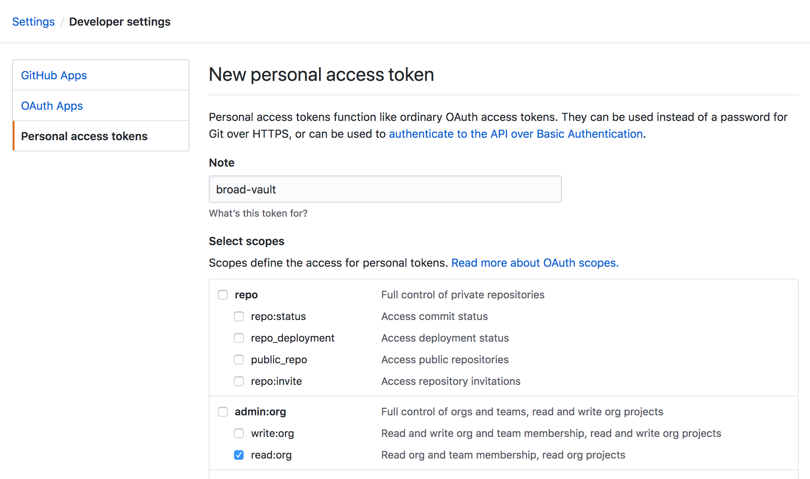

# Dev Setup

## Set up Java
We use [Graal VM](https://www.graalvm.org/) in our service containers for its improved JIT optimizations.
If you're running OS X, run [this script](../scripts/setup-graal) to install the VM locally and set it up
on your path.

If you aren't running OS X, it should be possible to manually perform the steps in the script. The download
URL will be slightly different, but you should be able to find it in Graal's [GitHub release page](https://github.com/oracle/graal/releases).

## Install Tools
If you're running OS X, run [this script](../scripts/install-tools) to install all the software we use for
development. It isn't fully automated (a few steps require confirmation / entering a login), but
it should grab everything you need for development work.

If you aren't running OS X, I'm sorry.

### Cask Apps
The installation script will download a few OS X applications, but you'll need to manually
start them. Use spotlight to find and launch:
* `Docker.app`
* `JetBrains Toolbox.app`
* `Visual Studio Code.app`

### Logging In
Once you've launched Docker, you can log in with your DockerHub credentials and cross-link to Google.
Run [this script](../scripts/login) to walk through the steps. You'll be prompted to enter your credentials.

### IntelliJ
Once you've installed the JetBrains Toolbox, you can use it to install IntelliJ.
1. Click the Toolbox's icon in the status bar (upper right-hand corner).
   
2. Find "IntelliJ IDEA Community" in the list of available IDEs, and click "Install".
3. After the installation completes, open the app and work through the initial setup
   dialogs. When asked, make sure to select the "Scala" plugin for installation.

### Firefox
If you prefer to use Firefox over Chrome, make sure to install the
[ESR version](https://www.mozilla.org/en-US/firefox/organizations/all/?q=engli). BITS' security scanners are
generally lax about what users set up on their machines, but for some reason they've decided to blacklist non-ESR FF.

## Set up Vault
[Vault](https://www.vaultproject.io/) is our preferred solution for securely storing / sharing
secret configuration values. We use GitHub teams to drive access policies for our secrets. Follow
these steps to configure the `vault` command-line tool (installed by the setup script) using
your GitHub account:

1. Create a new developer token in GitHub using [this page](https://github.com/settings/tokens/new).
   * Name the token something informative (in case you need to re-generate it later).
   * Under the "admin:org" header, select "read:org".
     
   * Copy the generated token, and save it to a stable file on your laptop (i.e. `~/.vault-github-token`).
2. Run [this script](../scripts/setup-vault) with the path to your downloaded token file as an argument:
   ```bash
   getting-started/scripts/setup-vault ~/.vault-github-token
   ```
3. Check if you can list Monster's secrets:
   ```bash
   vault list secret/dsde/monster/dev/
   ```

NOTE: Since Vault access is tied to GitHub team membership, and GitHub team membership is (often)
tied to Google Group membership, you might not be able to successfully view Monster secrets until
all your requests for group access are approved. Ask the Tech Lead for an extra set of eyes if
you hit an authorization error running the list command above.

## Set up GitHub
We recommend using SSH keys to connect to GitHub, to avoid annoying requests for username/password
on the terminal.

1. If you haven't generated a local SSH key on your laptop, follow
   [these steps](https://help.github.com/en/articles/generating-a-new-ssh-key-and-adding-it-to-the-ssh-agent)
   to generate a new one and register it with the SSH agent. Use your Broad email address.
2. Follow [these steps](https://help.github.com/en/articles/adding-a-new-ssh-key-to-your-github-account)
   to add your newly-generated SSH key to your GitHub account.
3. Make sure the correct name / email is registered in your local git configuration:
   ```bash
   git config --global user.name # Does this print your name?
   git config --global user.email # Does this print your Broad email?
   # If either of the above print something incorrect, use these commands to fix them:
   # git config --global user.name "Your Correct Name"
   # git config --global user.email "$(whoami)@broadinstitute.org"
   ```
4. Run [this script](../scripts/clone-repositories) to clone all of Monster's main GitHub repositories
   into a parent directory of your choosing.
   ```bash
   getting-started/scripts/clone-repositories ${HOME}
   ```
